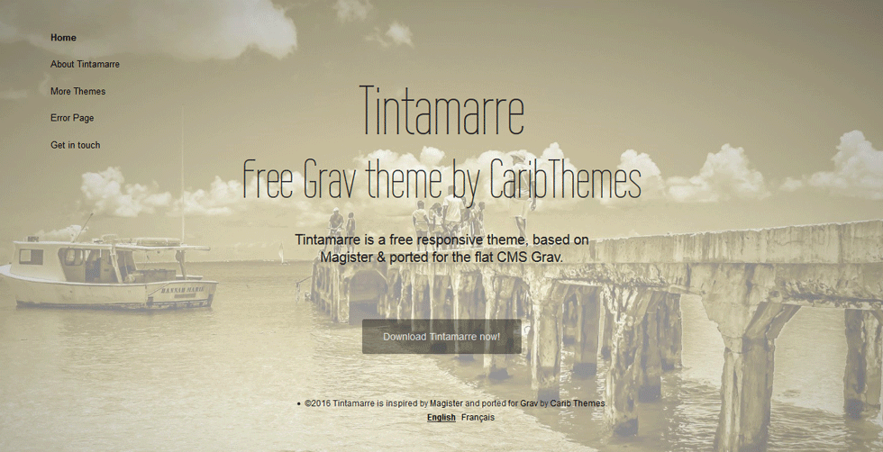

# Tintamarre Theme for the CMS Grav

> **Tintamarre** is a **FREE** minimalist responsive Theme ported by [**CaribThemes**](http://caribthemes.io) for the [**Grav**](http://getgrav.org) CMS and inspired by Magister by Sergey Pozhilov.

##### Table of Contents:

* [Demo](#demo)
* [Features](#features)
* [Installation](#installation)
* [Showcase](#showcase)
* [Support & Bugs](#support--bugs)
* [Credits](#credits)

## Demo

See the **Tintamarre** Template live [here](http://caribthemes.io/demo/tintamarre)

## Features
* Fully Responsive
* HTML5 and CSS3
* Contact Form
* Multilingual ready - (demo in :uk: & :fr:)
* Custom Error page

## Installation

### Basic Setup for a new Grav site

The simplest way to install Tintamarre Theme for Grav is to download and install the Tintamarre Skeleton package:

* Download [Tintamarre Skeleton on Grav](http://getgrav.org/downloads/skeletons#extras) or the latest release on [GitHub](https://github.com/CaribThemes/grav-skeleton-tintamarre/releases).
* Simply unzip the package into your web root folder.
* Point your browser at the folder, job done!

> TIP: Check out the general [Grav installation instructions](http://learn.getgrav.org/basics/installation) for more details on this process.

### Existing Grav site

Installing the **Tintamarre** Theme can be done in one of two ways. Via GPM (Grav Package Manager) installation method enables you to quickly and easily install the theme with a simple terminal command, while the manual method enables you to do so via a zip file.

To install **just** the theme:

<code>$ bin/gpm install tintamarre</code>

>> NOTE: This theme is a modular component for Grav which requires the [Grav](http://github.com/getgrav/grav), [Error](https://github.com/getgrav/grav-theme-error) and [Problems](https://github.com/getgrav/grav-plugin-problems) plugins.

>> Contact Form Configuration
For contact form configuration instructions please refer to [official documentation](http://learn.getgrav.org/advanced/contact-form). Make sure you installed Email and simple_form plugin though.

## Showcase
You want to share your site build with Tintamarre?
Feel free to add your site here...

## Support & Bugs
* If you find bugs, please report them on [here](https://github.com/CaribThemes/grav-theme-tintamarre/issues)

## Credits
* [Grav](http://getgrav.org) by [RocketTheme](http://www.rockettheme.com). Licensed under [MIT](https://github.com/CaribThemes/grav-theme-tintamarre/master/LICENSE.md)
* Photos by MATsxm for [IDIM<em>web</em>.com](http://idimweb.com). Licensed under __BeerWare__ (see LICENSE)
* Inspired by the template Magister by [Sergey Pozhilov](http://pozhilov.com)

>> __DISCLAIMER__

>>Note that @Sandra97 has never been involved in the CSS excepted for having killed few _!important;_ :stuck_out_tongue:

[CaribThemes](http://caribthemes.io), free web resources is proudly brought to you by [IDIM<em>web</em>.com](http://idimweb.com)

